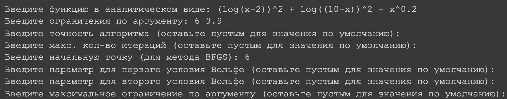

<html>
	<body>
		<h2>Оптимизационные задачи в машинном обучении.   Проект № 2: Методы одномерной оптимизации.</h2>
		

		<h3>Документация</h3>
		<h4>Всю документацию о проекте вы можете найти <a href = "">здесь</a></h4>
		

		<h3>Решение задач</h3>
		<h4>Решить свою задачу можно в  </h4>
		

		<h3>Примеры решения задач</h3>
		<h5>Ввод параметров функции: </h5> 
		
		<h5>Вывод: </h5> 
		
		<h5>Ввод параметров функции и вывод : </h5> 
		
		

		<h4>Ввод параметров функции: </h4>
		
		<h5>Вывод таблицы: </h5> 
		
		

		<h3>Участники проекта</h3>
		<h4>
		<li>Белоцерковский Даниил - Менеджер проектa</li>
		<li>Хасыков Бата - Программист</li>
		<li>Пучков Александр - Аналитик</li>
		<li>Поплевин Роман - Аналитик, Тестировщик</li>
		<li>Бады Денис - Тестировщик</li>
		 
		Группа ПМ19-3
		</h4>
  </body>

</html>
